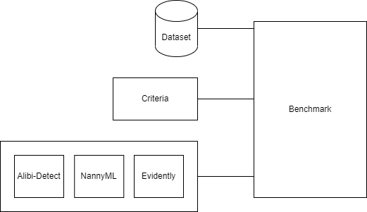

# D3Bench: Benchmarking Open Source Tools for Dataset Drift Detection
=====================================================================

This repository contains the source code of the paper titled "Open-Source Drift Detection Tools in Action: Insights from Two Use Cases". The aim of D3Bench is to compare the most common tools for detecting dataset shifts. Through this comparison, deficiencies and limitations of the tools can be identified, and future research directions can be explored. Additionally, it can be determined which tools are mature enough for industrial use. The comparison criteria are as follows:

* **Functional Suitability**: The tool should reliably detect shifts.
* **Integration Capabilities**: The tool should be integrable into the MLOps pipeline, preferably with Grafana and MLflow.
* **Flexibility**: The tool should be able to handle various data types.
* **Usability**: The tool should be user-friendly and easy to use.
* **Runtime and Resource Usage**: The tool should perform calculations quickly and use as little memory as possible.

## Setup

Clone the repository with submodules:
```shell
git clone https://git.sagresearch.de/kompaki/edd/d3-benchmark.git --recurse-submodules
```

The installation prerequisites are:
```shell
python3 -m venv venv 
source venv/bin/activate
pip3 install --upgrade setuptools
pip3 install --upgrade pip
pip3 install -e .

pip3 install psutil
pip3 install memory_profiler
pip3 install sklearn
pip3 install evidently
pip3 install alibi_detect[tensorflow] # needs enough space on disk
pip3 install nannyml
pip3 install IPython
```

## Structure



* **script**: A complete benchmarking with five runs can be performed using the script in the script folder.
* **main**: The three classes of the benchmarking process and their subclasses are implemented here.  
	* **Benchmark**: The Benchmark class is the controlling class that manages the benchmarking. This class conducts benchmarking based on selected criteria and tools (Alibi-Detect, NannyML, and Evidently AI) for a dataset.  
	* **Dataset**: The Dataset class binds the dataset and performs preprocessing steps. It splits the dataset into training and test data.  
	* **Tool**: The Tool class is the parent class for the subclasses Alibi-Detect, NannyML, and Evidently. Each tool implements the necessary preprocessing steps and the calculation of shift values for each method.
* **main/results**: The results of the functional and non-functional criteria are stored in the main/results folder. The results can be read using the Jupyter Notebook. The generated reports from Evidently AI and NannyML are stored in main/results/reports.

## Usage

the script can be executed via the console:
```shell
python3 main/main.py
```